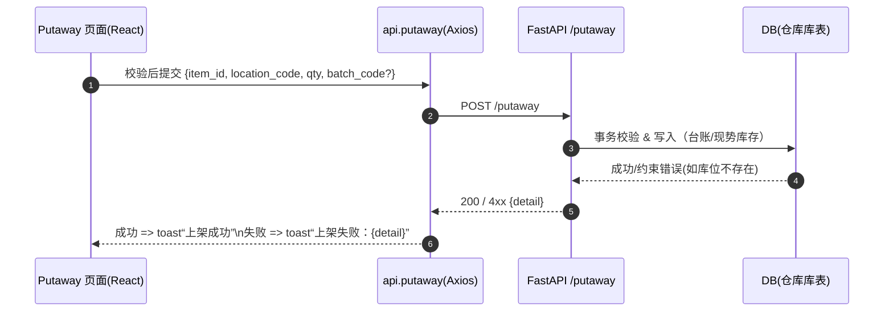

# WMS-DU｜前端启动与接口联调图谱（React + Vite + TS + Tailwind + shadcn/ui）

---

## 一、分层职责结构图

```mermaid
graph TD
    subgraph Runtime[运行时与构建]
      Vite[Vite\n本地开发服务器/构建器\nESM/HMR/打包优化]
      TS[TypeScript\n类型系统/编译期检查]
    end

    subgraph UI[界面层]
      React[React 组件树\n状态 -> 视图 的声明式渲染]
      Shadcn[shadcn/ui 组件\n可拷贝源码、可无障碍、与 Tailwind 深度耦合]
      Tailwind[Tailwind CSS\n原子化样式/主题/设计令牌]
    end

    subgraph Logic[页面与应用逻辑]
      Pages[Pages/Routes\n如 Putaway.tsx, Inbound.tsx]
      Hooks[Hooks/状态管理\n表单校验、请求状态、缓存]
      API[lib/api.ts\nAxios 封装/错误拦截/DTO 类型]
    end

    subgraph Backend[后端服务（FastAPI）]
      Endpoints[/inbound/receive\n/putaway\n/stock/query\n/ledger/recent]
    end

    Vite --> React
    TS --> React
    TS --> API
    Tailwind --> Shadcn
    Shadcn --> React
    React --> Pages
    Pages --> Hooks
    Hooks --> API
    API --> Endpoints
```

---

## 二、首次联调：一次请求的生命旅程



---

## 三、阅读与实践提示

- **React**：以函数组件表达状态与视图的映射，保持单向数据流。
- **Pages/Hooks**：放置业务逻辑与表单交互，是前端的“服务层”。
- **api.ts**：统一封装所有请求逻辑，保障类型安全与错误一致性。
- **Tailwind + shadcn/ui**：形成统一视觉体系与可复用组件库。
- **Vite + TypeScript**：分别负责性能与质量——快与稳的底层支撑。

---

## 四、下一步扩展建议

1. **Canvas 联动**：将此图与后端的 CI 流程图并列，形成“前后双主链”。
2. **文档落地**：同步保存为 `docs/fe-mvp.md` 以供新开发者快速启动。
3. **错误对照表**：在后续 Canvas 中补充常见联调错误（CORS、400/422、超时、字段错位）。
4. **主题与可定制性**：在 Tailwind 变量层抽象颜色与圆角，形成统一的 Design Token。


---

## 五、常见联调错误与排查清单（MVP）

> 目标：缩短“发现 → 定位 → 解决”的闭环。优先检查从 **环境 → 网络 → CORS → 路由/负载 → 数据** 五层。

### A. 环境与端口（ENV / PORT）
- **症状**：前端 404 或一直 loading，Network 面板无请求。
- **排查**：
  1) `pnpm dev` 是否成功启动？默认 `http://127.0.0.1:5173`
  2) 后端 `uvicorn app.main:app --reload` 是否在 `http://127.0.0.1:8000`？
  3) `.env.local` 中 `VITE_API_URL` 是否指向后端？是否多/少了尾部斜杠。
- **修复**：
  - 统一使用：`VITE_API_URL=http://127.0.0.1:8000`（无尾斜杠），`api.ts` 再拼路径。

### B. CORS / 预检（OPTIONS）
- **症状**：浏览器控制台报错 *CORS policy: No 'Access-Control-Allow-Origin' header*；或 `OPTIONS /putaway 403/5xx`。
- **排查**：
  - FastAPI 是否添加：
    ```python
    from fastapi.middleware.cors import CORSMiddleware
    app.add_middleware(
        CORSMiddleware,
        allow_origins=["http://127.0.0.1:5173","http://localhost:5173"],
        allow_credentials=True,
        allow_methods=["*"],
        allow_headers=["*"],
    )
    ```
  - Network 面板查看是否先发 `OPTIONS`，其响应头是否含 `access-control-allow-origin`。
- **修复**：
  - 补齐 CORS 中的域名（注意 http/https、端口一致）。
  - 若走反向代理（Nginx/Caddy），确认未吞掉 `OPTIONS`。

### C. 路由不匹配（404 / 405）
- **症状**：`POST /putaway` 返回 404 或 405（方法不允许）。
- **排查**：
  - FastAPI 实际路由是否带前缀（如 `/api/putaway`）？
  - `api.ts` 的路径是否与后端一致？
  - 用 `curl` 快速验证：
    ```bash
    curl -s -X POST http://127.0.0.1:8000/putaway \
      -H 'Content-Type: application/json' \
      -d '{"item_id":1,"location_code":"L12","qty":1}' | jq
    ```
- **修复**：两端统一路径前缀；必要时在 `vite.config.ts` 使用 dev 代理：
  ```ts
  server: { proxy: { '/api': 'http://127.0.0.1:8000' } }
  ```

### D. 数据校验（400 / 422 Unprocessable Entity）
- **症状**：后端返回 422，前端吐司显示“上架失败：{detail}”。
- **排查**：
  - 查看响应体：字段名、类型、必填项是否匹配 Pydantic 模型。
  - 前端 zod/`react-hook-form` 的规则是否与后端一致（数字用 `z.coerce.number()`，可空字段允许 `null/undefined`）。
- **修复**：
  - 统一 DTO：在 `lib/api.ts` 声明接口类型，并在页面使用同源类型。
  - 保持“前端先行校验、后端最终裁决”。

### E. 服务器错误（500 / 503）
- **症状**：接口 500，日志报数据库约束或事务异常。
- **排查**：
  - 终端查看 uvicorn 日志；确认 `item_id`、`location_code` 是否存在。
  - Alembic 迁移是否到位；本地 DB 是否与模型一致。
- **修复**：
  - 先在后端用单元/集成测试跑通 happy path；必要时在 `/docs` 里先调通。

### F. 网络与证书（Mixed Content / HTTPS）
- **症状**：前端是 https，后端是 http，被浏览器拦截；或 Mixed Content。
- **排查**：
  - Dev 阶段尽量同为 http；或给后端加自签证书 + 可信 CA。
- **修复**：
  - 统一协议，或在反向代理层（Caddy/Nginx）做 TLS 终止。

### G. 鉴权与 Cookie（跨域携带）
- **症状**：登录后接口仍 401；或 Session 丢失。
- **排查**：
  - Axios 是否设置 `withCredentials`；CORS 是否 `allow_credentials=True`；Set-Cookie 是否含 `SameSite=None; Secure`。
- **修复**：
  - 明确鉴权方案（Header Bearer 或 Cookie）；两端一致配置。

### H. HMR/缓存与“幽灵错误”
- **症状**：改了代码但页面行为不变；旧 env 未生效。
- **排查**：
  - 重启 `pnpm dev`；删除 `.vite` 缓存；确认 `.env.local` 被重新读取。
- **修复**：
  - 变更 `VITE_` 开头变量后重启；慎用浏览器缓存（清理或禁用缓存）。

---

## 六、最小化自检 Checklist（复制即用）

- [ ] 前端起于 `http://127.0.0.1:5173`，后端起于 `http://127.0.0.1:8000`
- [ ] `.env.local` 仅含：`VITE_API_URL=http://127.0.0.1:8000`
- [ ] FastAPI 已开启 CORS（含 `localhost` 与 `127.0.0.1`）
- [ ] `api.ts` 中基础 URL 无尾斜杠，路径拼接一致
- [ ] `PUTAWAY` 表单：`item_id`/`qty` 为整数、`location_code` 非空、`batch_code` 可选
- [ ] `curl`/`/docs` 能走通一次 PUTAWAY
- [ ] DevTools Network 里 `OPTIONS` 与主请求都 2xx
- [ ] 遇到 4xx/5xx 有可读 `detail`，前端吐司正常显示

---

## 七、典型错误与对照（速查表）

| 现象 | 可能原因 | 快速动作 |
|---|---|---|
| CORS 报错 | 未允许 5173 源 | FastAPI CORS 加入 `http://127.0.0.1:5173` |
| 404/405 | 路径或方法错 | 用 `curl` 校验真实路由；统一前缀 |
| 422 | 字段/类型不符 | 对齐 zod ⇄ Pydantic；数字用 `coerce.number()` |
| 500 | 约束/事务失败 | 检查 DB 预置数据、迁移、日志堆栈 |
| Mixed Content | https/http 混用 | 协议统一或代理 TLS 终止 |
| 401 | Cookie/Token 丢失 | `withCredentials` 与 CORS credentials 对齐 |


---

## 八、接口契约对齐（zod ⇄ Pydantic）+ 一键 Mock（MSW）

> 目的：前后端字段、类型、必填项 100% 一致；在后端不在线时，前端可用 **MSW**（Mock Service Worker）离线联调。

### 8.1 后端（FastAPI / Pydantic）契约示例
> 若你的后端已有实现，仅核对字段名与可空性；下述为对齐用的最小模型草案。

```python
# app/schemas/inbound.py
from pydantic import BaseModel, Field
from typing import Optional

class InboundReceiveReq(BaseModel):
    item_id: int = Field(gt=0)
    accepted_qty: int = Field(gt=0)
    batch_code: Optional[str] = None

class InboundReceiveResp(BaseModel):
    item_id: int
    batch_id: Optional[int] = None
    accepted_qty: int
```

```python
# app/schemas/putaway.py
from pydantic import BaseModel, Field
from typing import Optional

class PutawayReq(BaseModel):
    item_id: int = Field(gt=0)
    location_code: str
    qty: int = Field(gt=0)
    batch_code: Optional[str] = None

class PutawayResp(BaseModel):
    move_id: int
    item_id: int
    location_code: str
    delta: int
    batch_code: Optional[str] = None
```

```python
# app/schemas/stock.py
from pydantic import BaseModel
from typing import Optional, List

class StockQueryReq(BaseModel):
    item_id: Optional[int] = None
    location_code: Optional[str] = None

class StockRow(BaseModel):
    item_id: int
    location_code: str
    qty: int

class StockQueryResp(BaseModel):
    rows: List[StockRow]
```

```python
# app/schemas/ledger.py
from pydantic import BaseModel, Field
from typing import Optional, List
from datetime import datetime

class LedgerRecentReq(BaseModel):
    limit: int = Field(default=20, gt=0, le=200)

class LedgerRow(BaseModel):
    id: int
    ts: datetime
    item_id: int
    location_code: str
    delta: int
    reason: str
    ref: Optional[str] = None
    batch_code: Optional[str] = None

class LedgerRecentResp(BaseModel):
    rows: List[LedgerRow]
```

### 8.2 前端（TypeScript / zod）镜像契约
> 放在 `src/lib/contracts.ts`，供表单与 api.ts 复用。

```ts
import { z } from "zod"

export const InboundReceiveReq = z.object({
  item_id: z.coerce.number().int().positive(),
  accepted_qty: z.coerce.number().int().positive(),
  batch_code: z.string().optional().nullable(),
})
export type InboundReceiveReq = z.infer<typeof InboundReceiveReq>
export const InboundReceiveResp = z.object({
  item_id: z.number().int(),
  batch_id: z.number().int().nullable().optional(),
  accepted_qty: z.number().int(),
})
export type InboundReceiveResp = z.infer<typeof InboundReceiveResp>

export const PutawayReq = z.object({
  item_id: z.coerce.number().int().positive(),
  location_code: z.string().min(1),
  qty: z.coerce.number().int().positive(),
  batch_code: z.string().optional().nullable(),
})
export type PutawayReq = z.infer<typeof PutawayReq>
export const PutawayResp = z.object({
  move_id: z.number().int(),
  item_id: z.number().int(),
  location_code: z.string(),
  delta: z.number().int(),
  batch_code: z.string().nullable().optional(),
})
export type PutawayResp = z.infer<typeof PutawayResp>

export const StockQueryReq = z.object({
  item_id: z.coerce.number().int().optional(),
  location_code: z.string().optional(),
})
export type StockQueryReq = z.infer<typeof StockQueryReq>
export const StockRow = z.object({
  item_id: z.number().int(),
  location_code: z.string(),
  qty: z.number().int(),
})
export const StockQueryResp = z.object({ rows: z.array(StockRow) })
export type StockQueryResp = z.infer<typeof StockQueryResp>

export const LedgerRecentReq = z.object({
  limit: z.coerce.number().int().positive().max(200).default(20),
})
export type LedgerRecentReq = z.infer<typeof LedgerRecentReq>
export const LedgerRow = z.object({
  id: z.number().int(),
  ts: z.string(),
  item_id: z.number().int(),
  location_code: z.string(),
  delta: z.number().int(),
  reason: z.string(),
  ref: z.string().nullable().optional(),
  batch_code: z.string().nullable().optional(),
})
export const LedgerRecentResp = z.object({ rows: z.array(LedgerRow) })
export type LedgerRecentResp = z.infer<typeof LedgerRecentResp>
```

> 建议：页面表单直接复用上述 `*Req` 作为 zod 校验器，`api.ts` 在入参出参处调用 `*.parse()` 进行双向校验。

### 8.3 `api.ts` 对齐（入参出参校验）

```ts
import axios from "axios"
import {
  InboundReceiveReq, InboundReceiveResp,
  PutawayReq, PutawayResp,
  StockQueryReq, StockQueryResp,
  LedgerRecentReq, LedgerRecentResp
} from "@/lib/contracts"

const BASE = import.meta.env.VITE_API_URL?.replace(/\/$/, "") || "http://127.0.0.1:8000"

axios.interceptors.response.use(r => r, err => {
  const detail = err?.response?.data?.detail || err?.message || "网络异常"
  return Promise.reject(new Error(detail))
})

export const api = {
  inboundReceive: async (data: unknown) => {
    const body = InboundReceiveReq.parse(data)
    const res = await axios.post(`${BASE}/inbound/receive`, body)
    return InboundReceiveResp.parse(res.data)
  },
  putaway: async (data: unknown) => {
    const body = PutawayReq.parse(data)
    const res = await axios.post(`${BASE}/putaway`, body)
    return PutawayResp.parse(res.data)
  },
  stockQuery: async (params: unknown) => {
    const q = StockQueryReq.parse(params)
    const res = await axios.get(`${BASE}/stock/query`, { params: q })
    return StockQueryResp.parse(res.data)
  },
  ledgerRecent: async (params: unknown = { limit: 20 }) => {
    const q = LedgerRecentReq.parse(params)
    const res = await axios.get(`${BASE}/ledger/recent`, { params: q })
    return LedgerRecentResp.parse(res.data)
  },
}
```

### 8.4 一键 Mock（MSW）
> 让前端在后端不在线时也能完整演示。默认开关：`VITE_USE_MSW=1` 开启；不设或为 `0` 则关闭。

**安装**：
```bash
pnpm add -D msw
```

**`src/mocks/handlers.ts`**：
```ts
import { http, HttpResponse } from 'msw'

export const handlers = [
  http.post('http://127.0.0.1:8000/inbound/receive', async ({ request }) => {
    const body = await request.json()
    return HttpResponse.json({ item_id: body.item_id, batch_id: 1, accepted_qty: body.accepted_qty })
  }),
  http.post('http://127.0.0.1:8000/putaway', async ({ request }) => {
    const body = await request.json()
    if (body.location_code === 'BAD') {
      return HttpResponse.json({ detail: '库位不存在' }, { status: 422 })
    }
    return HttpResponse.json({ move_id: 1001, item_id: body.item_id, location_code: body.location_code, delta: body.qty, batch_code: body.batch_code ?? null })
  }),
  http.get('http://127.0.0.1:8000/stock/query', () => {
    return HttpResponse.json({ rows: [ { item_id: 1, location_code: 'L12', qty: 10 } ] })
  }),
  http.get('http://127.0.0.1:8000/ledger/recent', () => {
    return HttpResponse.json({ rows: [ { id: 1, ts: new Date().toISOString(), item_id: 1, location_code: 'L12', delta: 10, reason: 'INBOUND', ref: 'PO-1', batch_code: 'B20251015' } ] })
  }),
]
```

**`src/mocks/browser.ts`**：
```ts
import { setupWorker } from 'msw/browser'
import { handlers } from './handlers'
export const worker = setupWorker(...handlers)
```

**在 `src/main.tsx` 中开关 MSW**：
```ts
async function enableMocking() {
  if (import.meta.env.VITE_USE_MSW !== '1') return
  const { worker } = await import('./mocks/browser')
  await worker.start({ serviceWorker: { url: '/mockServiceWorker.js' } })
}

await enableMocking()
```

**启用方式**：
```bash
# 开启离线联调
echo 'VITE_USE_MSW=1' >> .env.local
pnpm dev

# 关闭离线联调（连真实后端）
sed -i '/VITE_USE_MSW/d' .env.local
pnpm dev
```

### 8.5 cURL 与返回示例（核验对齐）

```bash
# inbound
curl -s -X POST $API/inbound/receive -H 'Content-Type: application/json' \
  -d '{"item_id":1,"accepted_qty":5,"batch_code":"B1"}' | jq

# putaway
curl -s -X POST $API/putaway -H 'Content-Type: application/json' \
  -d '{"item_id":1,"location_code":"L12","qty":3}' | jq

# stock
curl -s '$API/stock/query?item_id=1' | jq

# ledger
curl -s '$API/ledger/recent?limit=10' | jq
```

> 约定：错误统一返回 `{ detail: string }`，状态码使用 4xx/5xx；前端吐司直接显示 `detail`，便于排查。
