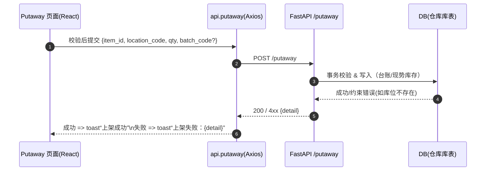

# WMS-DU｜前端启动与接口联调图谱（React + Vite + TS + Tailwind + shadcn/ui）

---

## 一、分层职责结构图

```mermaid
graph TD
    subgraph Runtime[运行时与构建]
      Vite[Vite\n本地开发服务器/构建器\nESM/HMR/打包优化]
      TS[TypeScript\n类型系统/编译期检查]
    end

    subgraph UI[界面层]
      React[React 组件树\n状态 -> 视图 的声明式渲染]
      Shadcn[shadcn/ui 组件\n可拷贝源码、可无障碍、与 Tailwind 深度耦合]
      Tailwind[Tailwind CSS\n原子化样式/主题/设计令牌]
    end

    subgraph Logic[页面与应用逻辑]
      Pages[Pages/Routes\n如 Putaway.tsx, Inbound.tsx]
      Hooks[Hooks/状态管理\n表单校验、请求状态、缓存]
      API[lib/api.ts\nAxios 封装/错误拦截/DTO 类型]
    end

    subgraph Backend[后端服务（FastAPI）]
      Endpoints[/inbound/receive\n/putaway\n/stock/query\n/ledger/recent]
    end

    Vite --> React
    TS --> React
    TS --> API
    Tailwind --> Shadcn
    Shadcn --> React
    React --> Pages
    Pages --> Hooks
    Hooks --> API
    API --> Endpoints
```

---

## 二、首次联调：一次请求的生命旅程



---

## 三、阅读与实践提示

- **React**：以函数组件表达状态与视图的映射，保持单向数据流。
- **Pages/Hooks**：放置业务逻辑与表单交互，是前端的“服务层”。
- **api.ts**：统一封装所有请求逻辑，保障类型安全与错误一致性。
- **Tailwind + shadcn/ui**：形成统一视觉体系与可复用组件库。
- **Vite + TypeScript**：分别负责性能与质量——快与稳的底层支撑。

---

## 四、下一步扩展建议

1. **Canvas 联动**：将此图与后端的 CI 流程图并列，形成“前后双主链”。
2. **文档落地**：同步保存为 `docs/fe-mvp.md` 以供新开发者快速启动。
3. **错误对照表**：在后续 Canvas 中补充常见联调错误（CORS、400/422、超时、字段错位）。
4. **主题与可定制性**：在 Tailwind 变量层抽象颜色与圆角，形成统一的 Design Token。
